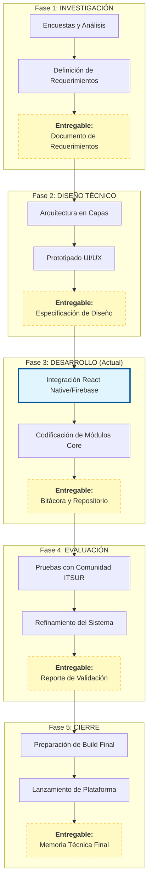

# Metodología: Marketplace Escolar ITSUR (Flujo Vertical)

Esta versión es **vertical** y muestra que la **Documentación** es un proceso continuo en cada etapa, tal como pediste. 

---

### 📊 Diagrama de Procesos con Documentación Integrada
Copia este código y pégalo en [Mermaid Live Editor](https://mermaid.live/).

---

### 💡 Guion para tu presentación (Enfoque Documental)
Para que se vea muy profesional el jueves, menciona esto:

*   **"Metodología Documentada":** "Nuestra metodología no deja los papeles para el final. Como ven en el diagrama, cada fase cierra con un entregable documental que garantiza la trazabilidad del proyecto".
*   **"Validación por Etapas":** "Esto nos permite que, por ejemplo, antes de programar en la Fase 3, ya tengamos un documento de diseño aprobado en la Fase 2".
*   **"Estado Real":** "Actualmente estamos en la **Fase 3**, trabajando simultáneamente en el código (React Native/Firebase) y en nuestra bitácora de avances técnicos".
